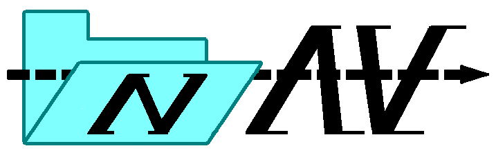
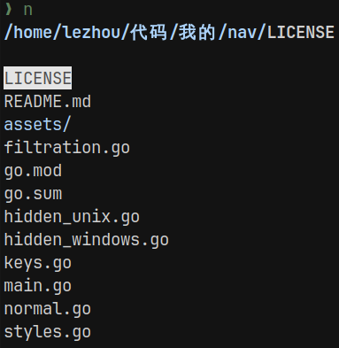
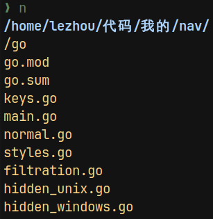
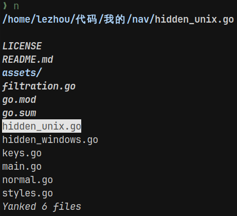

## About

Minimal terminal file manager/navigator

## Features
- Fuzzy filter searching
- Vi key bindings
- Copy, cut and pasting
- [`cd` on exit](#cd-on-exit-and-copy-file-selections-to-environmental-variable)
- [Selected files copied to environmental variable](#cd-on-exit-and-copy-file-selections-to-environmental-variable) and clipboard on exit

<p>



</p>

## Minimalism

Nav does not perform operations such as deleting files (`rm`), previewing files (`cat`), etc and does not provide an emulator for a command-line interface. These operations are better left for the user's existing command-line to handle. These operations can be done quickly with the copy selections to environmental variable or clipboard feature.

<p>

</p>

Nav does, however, allow copying and pasting/moving around files because that would be inconvenient using the above method.

For multiple selections you may have to do this:

```{sh}
echo $N | xargs cat # replace cat with program of your choice
```

## Installation

```{sh}
go install github.com/lezhou8/nav@latest
```

## Key binds

| Key | Description |
| :-: | :---------: |
| `hjkl or arrow keys` | Basic navigation |
| `g, G` | Go to top or bottom |
| `~` | Go to home directory |
| `.` | Toggle hidden files |
| `/` | Filter search |
| `esc` | Exit filter search |
| `enter` | Accept filter search |
| `space` | Select |
| `y` | Copy/yank |
| `d` | Cut |
| `p` | Paste |
| `q` | Quit |

## `cd` on exit and copy file selections to environmental variable

Zsh/Bash

```{sh}
# Call this function whatever you like
# Add to .zshrc, .bashrc, or equivalent

navcd() {
	nav "$@"
	cd "$(cat "${XDG_CACHE_HOME:=${HOME}/.cache}/nav/.nav_d")" # this line allows cd on exit
	export N="$(cat "${XDG_CACHE_HOME:=${HOME}/.cache}/nav/.nav_env")" # this line saves file selection to $N
}
```

```{sh}
# You can bind it to a key

bindkey -s "^n" "navcd\n"
```

## Built with

- [Go](https://golang.org/)
- [bubbletea](https://github.com/charmbracelet/bubbletea)
- [bubbles](https://github.com/charmbracelet/bubbles)
- [lipgloss](https://github.com/charmbracelet/lipgloss)
- [fuzzy](https://github.com/sahilm/fuzzy)
- [golang-set](https://github.com/deckarep/golang-set)
- [clipboard](https://github.com/atotto/clipboard)

## Dependencies
- [Go](https://golang.org/)

## Acknowledgement

- `cd` on exit [fff](https://github.com/dylanaraps/fff/tree/master)
- Fuzzy filter search [bubbles list](https://github.com/charmbracelet/bubbles/tree/master/list)
- Hidden fils [file picker](https://github.com/charmbracelet/bubbles/tree/master/filepicker)
